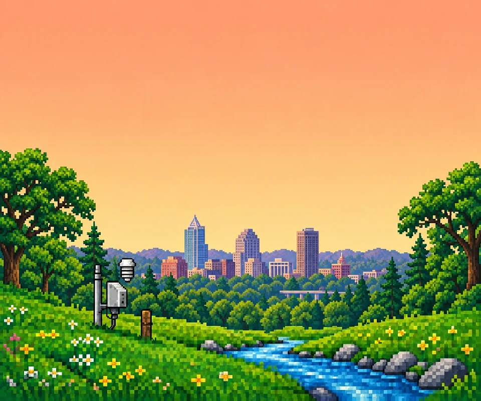

# Raleigh scene — version 1

Created September 8, 2026 with the built-in Imagegen tool, using the original meadow daylight plate as the visual and composition reference. The app uses this artwork for selected locations within 25 km of central Raleigh, including nearby GPS fixes. Other locations use the original meadow. Delivery copies live in `public/art` and are available offline.

The scene combines a downtown Raleigh skyline, mature oaks, low wooded Piedmont terrain, and a creek foreground. It is an illustrative Raleigh composite, not a literal view from one location. The regional direction draws from [Dix Park's oaks, meadows, and skyline views](https://dorotheadixpark.org/about) and [Raleigh's Walnut Creek greenway](https://raleighnc.gov/parks-and-recreation/places/walnut-creek-greenway-trail). No third-party photographs are incorporated.

## Ready-to-use artwork

| Lighting | Optimized plate | PNG master |
| --- | --- | --- |
| Daylight | [scene-raleigh-day-v1.webp](scene-raleigh-day-v1.webp) | [Original generation](sources/scene-raleigh-day-v1.png) |
| Overcast | [scene-raleigh-overcast-v1.webp](scene-raleigh-overcast-v1.webp) | [Original generation](sources/scene-raleigh-overcast-v1.png) |
| Night | [scene-raleigh-night-v1.webp](scene-raleigh-night-v1.webp) | [Original generation](sources/scene-raleigh-night-v1.png) |

All delivery plates are opaque 960×801 WebP images, matching the original app's shared scene stage. PNG masters retain the generator's 1374×1145 resolution. Delivery conversion uses Sharp, nearest-neighbor resizing, and WebP quality 86 / effort 6. The three WebPs total 283,074 bytes (276.4 KiB).

The workflow follows the original: create the daylight landscape, derive overcast and night through Imagegen lighting edits, then resize and encode the finished artwork. See [the complete prompt set](prompts.md).

## Layering and registration

- Keep the upper sky available for native weather text and separate clouds, celestial icons, and precipitation.
- The bare station mast, instrument box, and creek are composed around the existing 960×801 grid and its rotor `(195, 511)`, indicator `(229, 579)`, and river `(701, 744)` anchors.
- Station cups, water ripples, wildlife, motion controls, and live weather remain separate application layers, as in the original scene.
- Day, overcast, and night were derived from the same new daylight composition. The final app render was checked with the shared station and stream layers; generative lighting edits are not guaranteed to preserve every individual pixel.
- Dawn and dusk can reuse the original opacity blending between these three plates.

## Visual checks

The delivered images were inspected at native delivery size against the original artwork for five points: matching pixel texture and detail; the warm day, cool overcast, and indigo night palettes; clear upper sky; stable station and creek placement; and the low wooded Raleigh skyline framed by broad-crowned oaks. The PNG sources and WebPs were checked for complete decoding, equal dimensions within each set, and fully opaque output.

The shared stream layer adds moving currents, reflections, rock eddies, and drifting tap ripples. Browser checks compare actual rendered water pixels across animation phases in both Chromium and WebKit, exercise reduced motion and visibility, and switch saved places between Raleigh and the original meadow. Local in-app browser review also uses Raleigh's live weather. These are browser checks, not a physical-device performance claim.

