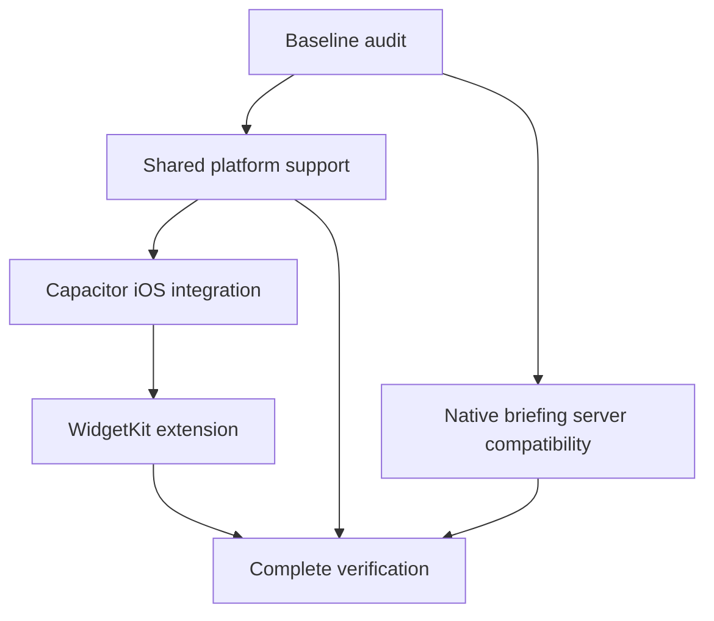

# iOS implementation and verification

Local implementation only. No push, backend deployment, or App Store submission is authorized by this task.

The shared iOS app and small/medium widgets are implemented and built for local review. Automated local acceptance checks pass. Apple Intelligence integration was added on September 11; see [the follow-up report](../ios-apple-briefing.md) for current AI behavior and verification. Production OpenAI fallback and physical-device acceptance remain dependent on external steps. The September 10 results below describe the original native conversion.

## Dependency graph

Engineering may proceed independently after contracts are agreed; completion gates follow these dependencies.

| Node | Owner | Status | Dependencies / evidence |
| --- | --- | --- | --- |
| Baseline audit | Parent | Passed | Remote NC CI success; 162 frontend + 22 server tests; Chromium/WebKit 153 passed/9 skipped; build/assets |
| Shared platform support | shared_platform | Automated checks passed | 188 frontend tests; 12 native bridge tests; Preferences/location/lifecycle/PWA/deep links; review fixes applied |
| Native briefing | briefing | Local compatibility passed | 37 server tests + 23 focused client/hook tests; exact CORS/HTTPS; production deployment remains external |
| iOS integration | native_ios | Passed locally | Signed app + extension build; four native simulator tests; focused audio and settled landscape checks |
| WidgetKit | widget | Passed locally | 18 artwork assets; 41 Swift checks; live small/medium rendering, tap routing, and independent extension refresh |
| Complete verification | Parent + review agent | Local checks passed; external checks pending | Web/native suites and builds pass; backend deployment, physical iPhone, and final manual checks require external access |

## Boundaries and known dependencies

- App identifier: `app.eightbitweather.app`; App Group: `group.app.eightbitweather.shared`.
- Place links: `eightbitweather://place?id=<encoded saved-place id>`.
- Existing web deployment stays independent of the bundled native build.
- Native production OpenAI fallback requires a separately approved backend deployment and origin configuration; local compatibility is in scope.
- Physical installation requires a reachable trusted device and appropriate signing/App Group provisioning. Unperformed checks must remain explicitly unverified.
- The paired iPhone was checked again at the end and remains offline. No signing team is configured. Connect/unlock the phone, enable Developer Mode if requested, and configure both targets with the same team's App Group before physical installation.
- The Mac locked during the final manual pass. Granted-location native UI and an additional stale-widget visual check remain unperformed until it is unlocked. Native denial was verified, granted-location bridge tests pass, and Swift stale/offline behavior is covered by passing tests.

## Evidence

Reproduce builds using [native build/install instructions](../ios-native.md), [widget tests](../ios-widget.md), and [native briefing configuration](../ios-briefing.md). Logs and screenshots are retained in [evidence](evidence/).

## Feature parity checklist

| Requirement | Implementation | Verification gate |
| --- | --- | --- |
| Shared screens, forecasts, rain/UV details | Same React product code and Open-Meteo normalization | Existing Chromium/WebKit suites + native bridge suite |
| Saved places, selected place, preferences | Preferences hydration before mount, ordered durable writes | Unit + native bridge + simulator relaunch |
| Automatic regional scenes, art and animations | Shared coordinate selection; 18 bundled art variants | Regional web tests, native asset checks, simulator screenshot |
| AI briefings and offline summaries | Apple Intelligence first, OpenAI fallback; shared cache and offline local generation | See [September 11 AI verification](../ios-apple-briefing.md); production cloud fallback still depends on deployment |
| Audio | Shared synthesis, tap activation, native background suspension, ambient audio session | Audio regression suite + simulator controls; physical sound output pending |
| Accessibility and layout | Shared labels/reduced motion; native safe-area insets | Responsive browsers + simulator screens; physical VoiceOver pending |
| Offline weather and app launch | Bundled shell/fonts/art; durable cached forecasts | Native persistence/bridge and simulator cache launch checks |
| Native location | When-in-use permission and denial fallback | Unit/bridge grant/denial tests + actual simulator prompt/denial; final manual grant awaits unlocked Mac |
| Lifecycle | App state listeners update weather freshness and suspend audio/motion | Native bridge + simulator background/resume |
| Small/medium widgets | Native WidgetKit views, local shared App Group, regional PNG artwork | Swift tests + extension build + simulator widget rendering |
| Widget refresh and stale/offline | Open-Meteo URLSession refresh; scheduled timeline and stale entries | Swift refresh/cache tests; actual schedule remains controlled by iOS |
| Widget tap routing | Validated custom scheme selects matching local place | Native bridge deep links + simulator openurl |

Physical-device and production dependencies are not counted as passed. Detailed evidence follows.

### Baseline (2026-09-10)

- Existing NC commit `322e2dc68dc987036cc025edd2e3b88c6b05f9fd`: [GitHub Actions run 34419906610](https://github.com/jdalbright/8-bit-weather/actions/runs/34419906610) completed successfully (queried live).
- Unmodified snapshot in `/tmp/8bit-weather-baseline`: type checking and lint passed.
- Initial `npm test` failed all 162 frontend tests because this Node 22.23.2 runtime exposed an undefined experimental global `localStorage`, shadowing jsdom. Re-running the unmodified snapshot with `NODE_OPTIONS=--no-experimental-webstorage` passed 162 frontend and 22 server tests; three opt-in live-provider tests skipped. Native Node ESM function smoke passed. This is a pre-existing local runner issue, not caused by native conversion.
- Baseline production build and asset checks passed: 2313.5 KiB / 3 MB budget.
- Baseline Chromium/WebKit: 153 passed, nine intentionally skipped (browser capability exclusions), 1.2 minutes; `/tmp/8bit-baseline-e2e.log`.
- Available simulator: iPhone 17 Pro, iOS 26.5, `893B0ADB-6BA1-4DF3-AC4C-D52134139EE5`.
- `xcrun xctrace list devices`: paired Jake’s iPhone (26.5.2) is offline. No physical-device behavior verified.
- Capacitor 8.5.1 npm audit reports three moderate development-tool findings through `@capacitor/cli → xcode → uuid`; no production dependency findings. No forced unrelated dependency changes applied.

### Completed local verification

- Type checking and lint passed after native changes.
- Shared app regression suite: 153 Chromium/WebKit tests passed, nine intentional skips, 1.7 minutes (`/tmp/8bit-current-e2e.log`).
- Web production build and asset budget passed: 2331.9 KiB / 3 MB.
- Native bundle build/check passed: all 18 artwork variants present; no PWA manifest/service-worker registration; bundled shell.
- Final signed simulator app is installed and available at `/tmp/eightbit-ios-final-derived/Build/Products/Debug-iphonesimulator/App.app`; final build log: `/tmp/eightbit-ios-final-build.log`.
- Xcode app + WidgetKit extension build succeeded (`/tmp/eightbit-ios-build.log`).
- Physical iPhone architecture Release build (unsigned) also succeeded (`/tmp/eightbit-ios-device-build.log`). This validates compilation only, not installation, signing, or device behavior.
- Independent source review completed with no unresolved blocking findings after fixes for native background motion, hydration-failure widget preservation, delayed cold-link ordering, cross-process refresh/clear coordination, and expired widget high/low.
- Final frontend unit tests: 188 passed across 22 files. Final server tests: 37 passed, three opt-in live-model tests skipped; Native Node ESM smoke passed (`/tmp/8bit-final-unit.log`).
- Final native browser bridge tests: 12/12 across Chromium and WebKit (7.9 seconds), including failed hydration preserving widget data. These tests mock native transport and do not substitute for simulator/device evidence.
- Final native test files also passed isolated strict TypeScript and ESLint checks.
- Swift widget harness: 41 checks passed (40 deterministic plus a real public Open-Meteo fetch), including offline and HTTP 429 behavior, cache clearing races, and timeline expiration; no AI provider credentials or costs involved.
- Native XCTest: four passed, zero failures (72 seconds), covering audio gesture and volume persistence; navigation, landscape, background/resume; denied permission and search fallback; cached offline launch, iOS deep-link switching, and cold-relaunch selected-place persistence. [Test log](evidence/simulator-tests.log). Focused audio repeat and settled landscape checks also passed.
- The offline test uses clearly labelled synthetic forecasts and a Debug-only WKWebView network-loss hook. Release compilation passed and binary strings confirmed the test hooks are absent. It does not substitute for physical radio-off testing.
- Simulator review improved range-control accessible names and removed inherited nighttime text shadows from the saved-observation badge. The original offline screenshot predates that small readability fix. Affected browser audio/layout tests passed (10 cases); final cached/offline browser regressions passed all four Chromium/WebKit cases. [Cache regression log](evidence/cache-regression.log).

### Simulator observation (iPhone 17 Pro, iOS 26.5)

- First boot stalled in CoreLocationMigrator; targeted shutdown/reboot recovered the simulator. No app failure was inferred from that migration.
- Ad hoc simulator signing is required to exercise App Groups. A build with `CODE_SIGNING_ALLOWED=NO` compiles but does not provide runtime group access. The signed app's `group.app.eightbitweather.shared` container was verified with `simctl get_app_container … groups`.
- Searched for Raleigh through the actual native app; live Open-Meteo forecast loaded, selected the Raleigh artwork, and published matching selected-place/weather data in the App Group.
- Added and visually inspected both small and medium Home Screen widgets: Raleigh, 72°F, clear skies, high 94° / low 69°, and matching regional artwork. These were observed provider data, not fixtures.
- Tapping the medium widget opened Raleigh's screen in the app.
- The extension also wrote its separate refreshed-weather file with newer real provider data after the app published an aged test cache. This verifies actual extension refresh execution independently of the app bridge; [recorded refresh metadata](evidence/widget-refresh.json). It does not prove a guaranteed 30-minute OS schedule.
- Native location permission prompt appeared; after denial, the app displayed the iPhone Settings fallback while city search remained usable.
- Review screenshots: [native app](evidence/simulator-raleigh-live.png), [small widget](evidence/widget-small-live.png), [medium widget](evidence/widget-medium-live.png), [location denial](evidence/simulator-location-denied.png).
- Additional native evidence: [cached offline app](evidence/native-test-offline-cache.png), [settled landscape](evidence/native-test-landscape.png), [background/resume](evidence/native-test-resume.png).
- Audible output, actual radio-off hardware behavior, physical VoiceOver, and long-duration device scheduling remain physical-device checks.
